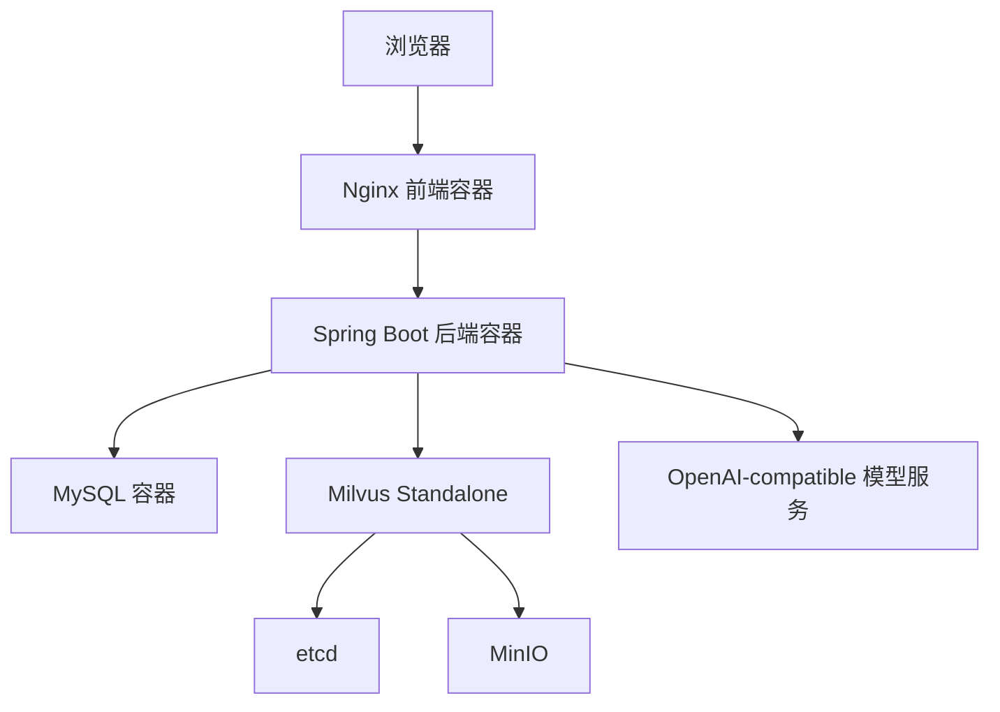

# 企业知识库智能问答系统 Docker 部署文档

## 1. 文档说明

本文档用于说明“基于大模型的企业知识库智能问答系统”的 Docker 部署方案。项目采用前后端分离架构：

- 前端：Vue3 + TypeScript + Vite + Element Plus
- 后端：Spring Boot
- 数据库：MySQL
- 向量数据库：Milvus
- AI SDK：项目内自研轻量级 Agent/RAG SDK
- 模型服务：OpenAI-compatible 接口，例如硅基流动等兼容 `/chat/completions`、`/embeddings` 的服务

本文档重点解决以下问题：

- 如何打包前端镜像
- 如何打包后端镜像
- 如何通过 Docker Compose 启动 MySQL、Milvus、后端、前端
- 如何配置大模型 API Key
- 如何配置 Milvus 向量库
- 如何排查常见部署问题

当前部署方案定位为“项目演示和课程/竞赛展示可用”的 Docker 部署方案，不是严格生产环境方案。生产环境还需要补充 HTTPS、权限、日志采集、监控、备份、密钥托管、网关限流等能力。

---

## 2. 项目目录约定

建议项目目录保持如下结构：

```text
企业知识库智能问答系统/
├── service/
│   ├── agent/
│   │   └── 自研 Agent/RAG SDK 模块
│   └── server/
│       └── Spring Boot 后端服务
├── web/
│   └── Vue3 + Vite 前端项目
├── deploy/
│   ├── docker-compose.yml
│   ├── .env
│   ├── mysql/
│   │   └── init.sql
│   ├── nginx/
│   │   └── default.conf
│   └── README.md
```

如果你的实际项目目录和上面不完全一样，需要根据真实目录调整 Dockerfile 中的路径。

---

## 3. 部署架构

Docker 部署后，整体架构如下：



容器说明：

| 容器 | 作用 |
|---|---|
| `kb-web` | 前端静态资源服务，使用 Nginx |
| `kb-server` | Spring Boot 后端服务 |
| `kb-mysql` | 保存用户、知识库、文档、聊天历史等业务数据 |
| `milvus-standalone` | 保存文本向量，提供向量检索 |
| `milvus-etcd` | Milvus 元数据依赖 |
| `milvus-minio` | Milvus 对象存储依赖 |

---

## 4. 端口规划

| 服务 | 容器端口 | 宿主机端口 | 说明 |
|---|---:|---:|---|
| 前端 Nginx | 80 | 80 | Web 页面访问入口 |
| 后端 Spring Boot | 8080 | 8080 | 后端 API |
| MySQL | 3306 | 3306 | 业务数据库 |
| Milvus | 19530 | 19530 | Milvus gRPC / HTTP 接入 |
| Milvus Metrics | 9091 | 9091 | Milvus 指标 |
| MinIO API | 9000 | 9000 | Milvus 对象存储 |
| MinIO Console | 9001 | 9001 | MinIO 控制台 |
| etcd | 2379 | 2379 | Milvus 元数据服务 |

如果宿主机已有服务占用这些端口，可以修改 `docker-compose.yml` 的端口映射。

---

## 5. 环境变量说明

建议在 `deploy/.env` 中统一配置部署变量。

### 5.1 后端基础配置

| 变量 | 示例 | 说明 |
|---|---|---|
| `SERVER_PORT` | `8080` | 后端服务端口 |
| `SPRING_PROFILES_ACTIVE` | `docker` | Spring Boot 启动环境 |
| `APP_UPLOAD_DIR` | `/app/uploads` | 文档上传目录 |

### 5.2 MySQL 配置

| 变量 | 示例 | 说明 |
|---|---|---|
| `MYSQL_ROOT_PASSWORD` | `root123456` | MySQL root 密码 |
| `MYSQL_DATABASE` | `knowledge_base` | 业务数据库名 |
| `MYSQL_USER` | `kb_user` | 业务数据库用户 |
| `MYSQL_PASSWORD` | `kb_password` | 业务数据库密码 |

### 5.3 大模型配置

后端代码中已有以下配置项：

| 配置项 | 环境变量写法 | 示例 |
|---|---|---|
| `agent.openai.base-url` | `AGENT_OPENAI_BASE_URL` | `https://api.siliconflow.cn/v1` |
| `agent.openai.streaming-base-url` | `AGENT_OPENAI_STREAMING_BASE_URL` | `https://api.siliconflow.cn/v1/chat/completions` |
| `agent.openai.api-key` | `AGENT_OPENAI_API_KEY` | `sk-xxxx` |
| `agent.openai.chat-model` | `AGENT_OPENAI_CHAT_MODEL` | `Qwen/Qwen3-8B` |
| `agent.openai.embedding-model` | `AGENT_OPENAI_EMBEDDING_MODEL` | `BAAI/bge-large-zh-v1.5` |
| `agent.openai.embedding-dimension` | `AGENT_OPENAI_EMBEDDING_DIMENSION` | `1024` |

注意：

- `AGENT_OPENAI_API_KEY` 必须配置，否则后端启动或调用模型时会失败。
- `AGENT_OPENAI_EMBEDDING_DIMENSION` 必须和 Milvus 集合中的向量维度一致。
- 如果 Embedding 模型返回 1024 维，Milvus collection 也必须是 1024 维。

### 5.4 Milvus 配置

后端代码中已有以下配置项：

| 配置项 | 环境变量写法 | 示例 |
|---|---|---|
| `agent.milvus.enabled` | `AGENT_MILVUS_ENABLED` | `true` |
| `agent.milvus.uri` | `AGENT_MILVUS_URI` | `http://milvus-standalone:19530` |
| `agent.milvus.token` | `AGENT_MILVUS_TOKEN` | 空 |
| `agent.milvus.collection-name` | `AGENT_MILVUS_COLLECTION_NAME` | `knowledge_base` |

注意：

- Docker Compose 内部访问 Milvus 时不能写 `localhost:19530`，应该写服务名：`http://milvus-standalone:19530`。
- 如果在宿主机直接访问 Milvus，才使用 `http://localhost:19530`。
- 当前 SDK 的 Milvus 封装主要负责插入和检索，不一定自动创建 collection。因此首次部署前可能需要手动创建 collection。

---

## 6. deploy/.env 示例

在项目根目录创建 `deploy/.env`：

```env
# =========================
# Spring Boot
# =========================
SERVER_PORT=8080
SPRING_PROFILES_ACTIVE=docker
APP_UPLOAD_DIR=/app/uploads

# =========================
# MySQL
# =========================
MYSQL_ROOT_PASSWORD=root123456
MYSQL_DATABASE=knowledge_base
MYSQL_USER=kb_user
MYSQL_PASSWORD=kb_password

# =========================
# OpenAI-compatible Model
# =========================
AGENT_OPENAI_BASE_URL=https://api.siliconflow.cn/v1
AGENT_OPENAI_STREAMING_BASE_URL=https://api.siliconflow.cn/v1/chat/completions
AGENT_OPENAI_API_KEY=请替换成你自己的API_KEY
AGENT_OPENAI_CHAT_MODEL=Qwen/Qwen3-8B
AGENT_OPENAI_EMBEDDING_MODEL=BAAI/bge-large-zh-v1.5
AGENT_OPENAI_EMBEDDING_DIMENSION=1024

# =========================
# Milvus
# =========================
AGENT_MILVUS_ENABLED=true
AGENT_MILVUS_URI=http://milvus-standalone:19530
AGENT_MILVUS_TOKEN=
AGENT_MILVUS_COLLECTION_NAME=knowledge_base
```

不要把真实 API Key 提交到 Git 仓库。

---

## 7. 后端配置文件建议

建议后端增加 `application-docker.yml`。

路径：

```text
service/server/src/main/resources/application-docker.yml
```

示例：

```yaml
server:
  port: ${SERVER_PORT:8080}

spring:
  datasource:
    url: jdbc:mysql://kb-mysql:3306/${MYSQL_DATABASE:knowledge_base}?useUnicode=true&characterEncoding=utf8&useSSL=false&serverTimezone=Asia/Shanghai&allowPublicKeyRetrieval=true
    username: ${MYSQL_USER:kb_user}
    password: ${MYSQL_PASSWORD:kb_password}
    driver-class-name: com.mysql.cj.jdbc.Driver

  jpa:
    hibernate:
      ddl-auto: update
    show-sql: false
    properties:
      hibernate:
        format_sql: true

  servlet:
    multipart:
      max-file-size: 50MB
      max-request-size: 100MB

app:
  upload:
    dir: ${APP_UPLOAD_DIR:/app/uploads}

agent:
  openai:
    base-url: ${AGENT_OPENAI_BASE_URL:https://api.siliconflow.cn/v1}
    streaming-base-url: ${AGENT_OPENAI_STREAMING_BASE_URL:https://api.siliconflow.cn/v1/chat/completions}
    api-key: ${AGENT_OPENAI_API_KEY}
    chat-model: ${AGENT_OPENAI_CHAT_MODEL:Qwen/Qwen3-8B}
    embedding-model: ${AGENT_OPENAI_EMBEDDING_MODEL:BAAI/bge-large-zh-v1.5}
    embedding-dimension: ${AGENT_OPENAI_EMBEDDING_DIMENSION:1024}

  milvus:
    enabled: ${AGENT_MILVUS_ENABLED:true}
    uri: ${AGENT_MILVUS_URI:http://milvus-standalone:19530}
    token: ${AGENT_MILVUS_TOKEN:}
    collection-name: ${AGENT_MILVUS_COLLECTION_NAME:knowledge_base}
```

如果项目中已经有 `application.yml`，可以把 Docker 专用配置单独放在 `application-docker.yml`，启动时通过：

```bash
SPRING_PROFILES_ACTIVE=docker
```

启用。

---

## 8. 后端 Dockerfile

建议在 `service/server/Dockerfile` 创建后端镜像文件。

### 8.1 多阶段构建版本

如果后端是 Maven 项目，推荐使用多阶段构建：

```dockerfile
# =========================
# Build Stage
# =========================
FROM maven:3.9-eclipse-temurin-21 AS builder

WORKDIR /build

# 如果 server 依赖同级 agent 模块，需要把整个 service 目录复制进来
COPY service/agent ./agent
COPY service/server ./server

WORKDIR /build/server

RUN mvn -U -DskipTests clean package

# =========================
# Runtime Stage
# =========================
FROM eclipse-temurin:21-jre

WORKDIR /app

ENV TZ=Asia/Shanghai

RUN mkdir -p /app/uploads

COPY --from=builder /build/server/target/*.jar /app/app.jar

EXPOSE 8080

ENTRYPOINT ["java", "-jar", "/app/app.jar"]
```

### 8.2 如果是父级 Maven 多模块项目

如果你的项目根目录有父级 `pom.xml`，并且 `agent` 和 `server` 是 Maven 多模块，可以改成：

```dockerfile
FROM maven:3.9-eclipse-temurin-21 AS builder

WORKDIR /build

COPY service ./service

WORKDIR /build/service

RUN mvn -U -DskipTests clean package

FROM eclipse-temurin:21-jre

WORKDIR /app

ENV TZ=Asia/Shanghai

RUN mkdir -p /app/uploads

COPY --from=builder /build/service/server/target/*.jar /app/app.jar

EXPOSE 8080

ENTRYPOINT ["java", "-jar", "/app/app.jar"]
```

根据你的真实 Maven 结构选择一个版本即可。

---

## 9. 前端 Dockerfile

建议在 `web/Dockerfile` 创建前端镜像文件。

```dockerfile
# =========================
# Build Stage
# =========================
FROM node:20-alpine AS builder

WORKDIR /build

COPY web/package*.json ./

RUN npm install

COPY web/ ./

RUN npm run build

# =========================
# Runtime Stage
# =========================
FROM nginx:1.27-alpine

COPY deploy/nginx/default.conf /etc/nginx/conf.d/default.conf

COPY --from=builder /build/dist /usr/share/nginx/html

EXPOSE 80

CMD ["nginx", "-g", "daemon off;"]
```

如果你的前端使用 `pnpm`，可以改成：

```dockerfile
FROM node:20-alpine AS builder

WORKDIR /build

RUN corepack enable

COPY web/package.json web/pnpm-lock.yaml ./

RUN pnpm install --frozen-lockfile

COPY web/ ./

RUN pnpm build

FROM nginx:1.27-alpine

COPY deploy/nginx/default.conf /etc/nginx/conf.d/default.conf
COPY --from=builder /build/dist /usr/share/nginx/html

EXPOSE 80

CMD ["nginx", "-g", "daemon off;"]
```

---

## 10. Nginx 配置

创建文件：

```text
deploy/nginx/default.conf
```

内容如下：

```nginx
server {
    listen 80;
    server_name _;

    root /usr/share/nginx/html;
    index index.html;

    client_max_body_size 100m;

    location / {
        try_files $uri $uri/ /index.html;
    }

    location /api/ {
        proxy_pass http://kb-server:8080/api/;
        proxy_http_version 1.1;

        proxy_set_header Host $host;
        proxy_set_header X-Real-IP $remote_addr;
        proxy_set_header X-Forwarded-For $proxy_add_x_forwarded_for;
        proxy_set_header X-Forwarded-Proto $scheme;

        proxy_connect_timeout 120s;
        proxy_send_timeout 120s;
        proxy_read_timeout 120s;
    }

    location /api/chat/stream {
        proxy_pass http://kb-server:8080/api/chat/stream;
        proxy_http_version 1.1;

        proxy_set_header Host $host;
        proxy_set_header X-Real-IP $remote_addr;
        proxy_set_header X-Forwarded-For $proxy_add_x_forwarded_for;
        proxy_set_header X-Forwarded-Proto $scheme;

        proxy_buffering off;
        proxy_cache off;
        proxy_read_timeout 300s;
        proxy_send_timeout 300s;
    }
}
```

注意：

- `/api/chat/stream` 是 SSE 流式接口，必须关闭 `proxy_buffering`。
- 如果不关闭代理缓冲，前端可能无法实时看到 token，而是等模型回答结束后一次性显示。

---

## 11. docker-compose.yml

创建文件：

```text
deploy/docker-compose.yml
```

内容如下：

```yaml
services:
  kb-mysql:
    image: mysql:8.4
    container_name: kb-mysql
    restart: unless-stopped
    environment:
      MYSQL_ROOT_PASSWORD: ${MYSQL_ROOT_PASSWORD}
      MYSQL_DATABASE: ${MYSQL_DATABASE}
      MYSQL_USER: ${MYSQL_USER}
      MYSQL_PASSWORD: ${MYSQL_PASSWORD}
      TZ: Asia/Shanghai
    ports:
      - "3306:3306"
    volumes:
      - kb_mysql_data:/var/lib/mysql
      - ./mysql/init.sql:/docker-entrypoint-initdb.d/init.sql:ro
    command:
      - --character-set-server=utf8mb4
      - --collation-server=utf8mb4_unicode_ci
      - --default-time-zone=+08:00
    healthcheck:
      test: ["CMD", "mysqladmin", "ping", "-h", "localhost", "-u", "root", "-p${MYSQL_ROOT_PASSWORD}"]
      interval: 10s
      timeout: 5s
      retries: 10
    networks:
      - kb-net

  milvus-etcd:
    image: quay.io/coreos/etcd:v3.5.18
    container_name: milvus-etcd
    restart: unless-stopped
    environment:
      ETCD_AUTO_COMPACTION_MODE: revision
      ETCD_AUTO_COMPACTION_RETENTION: "1000"
      ETCD_QUOTA_BACKEND_BYTES: "4294967296"
      ETCD_SNAPSHOT_COUNT: "50000"
    command: >
      etcd
      -advertise-client-urls=http://127.0.0.1:2379
      -listen-client-urls=http://0.0.0.0:2379
      --data-dir=/etcd
    volumes:
      - milvus_etcd_data:/etcd
    networks:
      - kb-net

  milvus-minio:
    image: minio/minio:RELEASE.2024-12-18T13-15-44Z
    container_name: milvus-minio
    restart: unless-stopped
    environment:
      MINIO_ACCESS_KEY: minioadmin
      MINIO_SECRET_KEY: minioadmin
    ports:
      - "9000:9000"
      - "9001:9001"
    command: minio server /minio_data --console-address ":9001"
    volumes:
      - milvus_minio_data:/minio_data
    healthcheck:
      test: ["CMD", "curl", "-f", "http://localhost:9000/minio/health/live"]
      interval: 30s
      timeout: 20s
      retries: 3
    networks:
      - kb-net

  milvus-standalone:
    image: milvusdb/milvus:v2.5.4
    container_name: milvus-standalone
    restart: unless-stopped
    command: ["milvus", "run", "standalone"]
    security_opt:
      - seccomp:unconfined
    environment:
      ETCD_ENDPOINTS: milvus-etcd:2379
      MINIO_ADDRESS: milvus-minio:9000
      MINIO_ACCESS_KEY_ID: minioadmin
      MINIO_SECRET_ACCESS_KEY: minioadmin
    ports:
      - "19530:19530"
      - "9091:9091"
    volumes:
      - milvus_data:/var/lib/milvus
    depends_on:
      milvus-etcd:
        condition: service_started
      milvus-minio:
        condition: service_healthy
    healthcheck:
      test: ["CMD", "curl", "-f", "http://localhost:9091/healthz"]
      interval: 30s
      timeout: 20s
      retries: 5
    networks:
      - kb-net

  kb-server:
    build:
      context: ..
      dockerfile: service/server/Dockerfile
    container_name: kb-server
    restart: unless-stopped
    env_file:
      - .env
    environment:
      SPRING_PROFILES_ACTIVE: ${SPRING_PROFILES_ACTIVE}
      SERVER_PORT: ${SERVER_PORT}
      APP_UPLOAD_DIR: ${APP_UPLOAD_DIR}

      MYSQL_DATABASE: ${MYSQL_DATABASE}
      MYSQL_USER: ${MYSQL_USER}
      MYSQL_PASSWORD: ${MYSQL_PASSWORD}

      AGENT_OPENAI_BASE_URL: ${AGENT_OPENAI_BASE_URL}
      AGENT_OPENAI_STREAMING_BASE_URL: ${AGENT_OPENAI_STREAMING_BASE_URL}
      AGENT_OPENAI_API_KEY: ${AGENT_OPENAI_API_KEY}
      AGENT_OPENAI_CHAT_MODEL: ${AGENT_OPENAI_CHAT_MODEL}
      AGENT_OPENAI_EMBEDDING_MODEL: ${AGENT_OPENAI_EMBEDDING_MODEL}
      AGENT_OPENAI_EMBEDDING_DIMENSION: ${AGENT_OPENAI_EMBEDDING_DIMENSION}

      AGENT_MILVUS_ENABLED: ${AGENT_MILVUS_ENABLED}
      AGENT_MILVUS_URI: ${AGENT_MILVUS_URI}
      AGENT_MILVUS_TOKEN: ${AGENT_MILVUS_TOKEN}
      AGENT_MILVUS_COLLECTION_NAME: ${AGENT_MILVUS_COLLECTION_NAME}
    ports:
      - "8080:8080"
    volumes:
      - kb_uploads:/app/uploads
    depends_on:
      kb-mysql:
        condition: service_healthy
      milvus-standalone:
        condition: service_healthy
    networks:
      - kb-net

  kb-web:
    build:
      context: ..
      dockerfile: web/Dockerfile
    container_name: kb-web
    restart: unless-stopped
    ports:
      - "80:80"
    depends_on:
      - kb-server
    networks:
      - kb-net

networks:
  kb-net:
    driver: bridge

volumes:
  kb_mysql_data:
  kb_uploads:
  milvus_etcd_data:
  milvus_minio_data:
  milvus_data:
```

---

## 12. MySQL 初始化脚本

创建文件：

```text
deploy/mysql/init.sql
```

内容可以先保持简单：

```sql
CREATE DATABASE IF NOT EXISTS knowledge_base
  DEFAULT CHARACTER SET utf8mb4
  DEFAULT COLLATE utf8mb4_unicode_ci;
```

如果后端使用 JPA `ddl-auto: update`，业务表可以由 Spring Boot 自动创建。

如果你后续整理出正式建表 SQL，可以把完整建表语句放到这个文件中。

---

## 13. Milvus Collection 初始化

当前 SDK 的 `MilvusEmbeddingStore` 主要负责插入和搜索，不一定负责自动创建 collection。为了保证部署后文档向量能写入，需要提前创建 Milvus collection。

### 13.1 推荐字段设计

如果使用当前 SDK 默认配置，推荐 Milvus collection 字段如下：

| 字段名 | 类型 | 说明 |
|---|---|---|
| `id` | Int64，主键，autoID | 主键 |
| `content` | VarChar | 文本片段 |
| `metadata` | JSON | 元数据 |
| `vector` | FloatVector | 文本向量 |

向量维度：

```text
1024
```

该维度必须和：

```text
AGENT_OPENAI_EMBEDDING_DIMENSION=1024
```

保持一致。

### 13.2 使用 Python 初始化 Milvus

可以创建临时脚本：

```text
deploy/milvus/create_collection.py
```

示例：

```python
from pymilvus import MilvusClient, DataType

client = MilvusClient(uri="http://localhost:19530")

collection_name = "knowledge_base"
dimension = 1024

if client.has_collection(collection_name):
    print(f"collection already exists: {collection_name}")
    raise SystemExit(0)

schema = client.create_schema(auto_id=True, enable_dynamic_field=False)

schema.add_field(
    field_name="id",
    datatype=DataType.INT64,
    is_primary=True,
)

schema.add_field(
    field_name="content",
    datatype=DataType.VARCHAR,
    max_length=65535,
)

schema.add_field(
    field_name="metadata",
    datatype=DataType.JSON,
)

schema.add_field(
    field_name="vector",
    datatype=DataType.FLOAT_VECTOR,
    dim=dimension,
)

index_params = client.prepare_index_params()

index_params.add_index(
    field_name="vector",
    index_type="AUTOINDEX",
    metric_type="COSINE",
)

client.create_collection(
    collection_name=collection_name,
    schema=schema,
    index_params=index_params,
)

client.load_collection(collection_name)

print(f"collection created and loaded: {collection_name}")
```

执行：

```bash
pip install pymilvus
python deploy/milvus/create_collection.py
```

如果你是在服务器上执行脚本，并且 Milvus 不在本机，需要把：

```python
MilvusClient(uri="http://localhost:19530")
```

改成对应服务器地址。

---

## 14. 构建和启动

进入部署目录：

```bash
cd deploy
```

确认 `.env` 已配置：

```bash
ls -la .env
```

启动：

```bash
docker compose up -d --build
```

查看容器：

```bash
docker compose ps
```

查看后端日志：

```bash
docker compose logs -f kb-server
```

查看前端日志：

```bash
docker compose logs -f kb-web
```

查看 Milvus 日志：

```bash
docker compose logs -f milvus-standalone
```

---

## 15. 访问系统

如果部署在本机：

```text
http://localhost
```

如果部署在服务器：

```text
http://服务器IP
```

后端 API：

```text
http://localhost:8080/api
```

Milvus：

```text
http://localhost:19530
```

MinIO 控制台：

```text
http://localhost:9001
```

默认 MinIO 账号：

```text
minioadmin
```

默认 MinIO 密码：

```text
minioadmin
```

---

## 16. 部署验证流程

启动完成后，建议按下面顺序验证。

### 16.1 检查容器状态

```bash
docker compose ps
```

所有核心容器应为 `running` 或 `healthy`。

### 16.2 检查后端健康

如果项目没有 Actuator，可以先直接访问登录接口或普通接口。

例如：

```bash
curl http://localhost:8080/api/kb
```

如果返回未登录或认证错误，说明后端至少已经正常响应。

### 16.3 检查前端页面

浏览器打开：

```text
http://localhost
```

确认：

- 页面能打开。
- 登录页正常显示。
- 登录后能进入系统。

### 16.4 检查 MySQL

进入 MySQL 容器：

```bash
docker exec -it kb-mysql mysql -u root -p
```

查看数据库：

```sql
SHOW DATABASES;
USE knowledge_base;
SHOW TABLES;
```

### 16.5 检查 Milvus

如果安装了 pymilvus：

```bash
python - <<'PY'
from pymilvus import MilvusClient
client = MilvusClient(uri="http://localhost:19530")
print(client.list_collections())
PY
```

应能看到：

```text
knowledge_base
```

### 16.6 检查模型调用

上传一份测试文档，然后进入问答页面提问。

如果后端日志出现：

```text
OpenAI request prepared
Milvus search request
Milvus search returned
```

说明模型调用和向量检索链路已经开始工作。

---

## 17. 常见问题排查

## 17.1 后端连接不上 MySQL

常见错误：

```text
Communications link failure
Connection refused
UnknownHostException
```

检查点：

1. Docker Compose 中后端连接 MySQL 应使用服务名 `kb-mysql`，不是 `localhost`。
2. MySQL 容器是否健康：

```bash
docker compose ps kb-mysql
```

3. 数据库账号密码是否和 `.env` 一致。
4. JDBC URL 是否写成：

```text
jdbc:mysql://kb-mysql:3306/knowledge_base
```

而不是：

```text
jdbc:mysql://localhost:3306/knowledge_base
```

---

## 17.2 后端连接不上 Milvus

常见错误：

```text
Milvus search 失败
connection refused
Name or service not known
```

检查点：

1. Docker Compose 内部 Milvus 地址应该是：

```text
http://milvus-standalone:19530
```

2. 宿主机访问才是：

```text
http://localhost:19530
```

3. 检查 Milvus 是否健康：

```bash
docker compose ps milvus-standalone
```

4. 查看日志：

```bash
docker compose logs -f milvus-standalone
```

---

## 17.3 Milvus 插入时报向量维度不一致

常见错误：

```text
vector dimension mismatch
查询的向量维度与集合的向量维度不一致
```

原因：

- Embedding 模型返回维度和 Milvus collection 字段维度不一致。

检查：

```env
AGENT_OPENAI_EMBEDDING_DIMENSION=1024
```

Milvus collection 的 `vector` 字段也必须是：

```text
dim=1024
```

如果你换了 Embedding 模型，比如 768 维或 4096 维，必须同步修改：

- 环境变量
- Milvus collection schema

已经创建的 Milvus collection 不能直接改向量维度，通常需要重建 collection。

---

## 17.4 大模型 API Key 没配置

常见错误：

```text
apiKey 不能为空
401 Unauthorized
```

检查 `.env`：

```env
AGENT_OPENAI_API_KEY=sk-xxxx
```

注意：

- 不要写中文占位符。
- 不要在 key 前后多加空格。
- 如果使用第三方兼容平台，确认 base-url 和 key 属于同一平台。

---

## 17.5 前端调用后端 404

原因可能是 Nginx 代理路径不正确。

检查 Nginx：

```nginx
location /api/ {
    proxy_pass http://kb-server:8080/api/;
}
```

如果后端接口路径是 `/api/chat/stream`，代理后也应该保持 `/api/chat/stream`。

---

## 17.6 流式回答不逐字显示

现象：

- 前端等很久没有输出。
- 模型回答结束后一次性显示。

原因：

- Nginx 对 SSE 开启了缓冲。

解决：

```nginx
location /api/chat/stream {
    proxy_buffering off;
    proxy_cache off;
    proxy_read_timeout 300s;
}
```

修改后重启前端容器：

```bash
docker compose up -d --build kb-web
```

---

## 17.7 上传文件失败

常见原因：

- 上传目录不存在。
- 容器内目录没有权限。
- Nginx 上传大小限制太小。
- Spring Multipart 限制太小。

检查上传目录挂载：

```yaml
volumes:
  - kb_uploads:/app/uploads
```

检查 Nginx：

```nginx
client_max_body_size 100m;
```

检查 Spring Boot：

```yaml
spring:
  servlet:
    multipart:
      max-file-size: 50MB
      max-request-size: 100MB
```

---

## 18. 常用运维命令

### 18.1 启动

```bash
docker compose up -d
```

### 18.2 构建并启动

```bash
docker compose up -d --build
```

### 18.3 停止

```bash
docker compose down
```

### 18.4 停止并删除数据卷

谨慎使用：

```bash
docker compose down -v
```

这会删除 MySQL、Milvus、MinIO、etcd 等数据。

### 18.5 查看日志

```bash
docker compose logs -f
```

查看指定服务：

```bash
docker compose logs -f kb-server
```

### 18.6 重新构建后端

```bash
docker compose up -d --build kb-server
```

### 18.7 重新构建前端

```bash
docker compose up -d --build kb-web
```

### 18.8 进入后端容器

```bash
docker exec -it kb-server sh
```

### 18.9 进入 MySQL 容器

```bash
docker exec -it kb-mysql bash
```

### 18.10 查看 Docker 网络

```bash
docker network ls
docker network inspect deploy_kb-net
```

---

## 19. 数据备份与恢复

### 19.1 MySQL 备份

```bash
docker exec kb-mysql mysqldump -u root -p${MYSQL_ROOT_PASSWORD} knowledge_base > backup.sql
```

如果环境变量没有在当前 shell 中加载，可以直接写密码：

```bash
docker exec kb-mysql mysqldump -u root -proot123456 knowledge_base > backup.sql
```

### 19.2 MySQL 恢复

```bash
docker exec -i kb-mysql mysql -u root -p${MYSQL_ROOT_PASSWORD} knowledge_base < backup.sql
```

### 19.3 上传文件备份

上传文件保存在 Docker volume：

```text
kb_uploads
```

可以通过临时容器备份：

```bash
docker run --rm \
  -v deploy_kb_uploads:/data \
  -v $(pwd):/backup \
  alpine \
  tar czf /backup/uploads-backup.tar.gz -C /data .
```

### 19.4 Milvus 数据备份

Milvus 数据由多个 volume 组成：

- `milvus_data`
- `milvus_etcd_data`
- `milvus_minio_data`

演示环境可以整体备份 Docker volume。生产环境建议使用 Milvus 官方备份工具或对象存储级备份方案。

---

## 20. 生产环境建议

当前 Compose 方案适合项目演示。如果要部署到正式环境，建议继续补充：

1. 使用 HTTPS。
2. API Key 使用密钥管理，不写入明文 `.env`。
3. MySQL 使用强密码和最小权限账号。
4. 前后端放到内网网络，不直接暴露后端端口。
5. 增加 Nginx 限流。
6. 增加后端健康检查接口。
7. 增加日志采集。
8. 增加 Prometheus / Grafana 监控。
9. 增加数据库定时备份。
10. 增加 Milvus 数据备份。
11. 使用 JWT 或 Session 机制替代简单 `X-User-Id`。
12. 文档上传增加文件类型白名单。
13. 上传文件做病毒扫描或安全校验。
14. 对流式接口设置合理超时时间。
15. 对模型调用增加重试、超时、熔断。

---

## 21. 最小部署步骤总结

如果只想快速跑起来，可以按下面步骤：

1. 创建 `deploy/.env`，填好模型 API Key。
2. 创建后端 `application-docker.yml`。
3. 创建 `service/server/Dockerfile`。
4. 创建 `web/Dockerfile`。
5. 创建 `deploy/nginx/default.conf`。
6. 创建 `deploy/docker-compose.yml`。
7. 启动服务：

```bash
cd deploy
docker compose up -d --build
```

8. 初始化 Milvus collection。
9. 浏览器访问：

```text
http://localhost
```

10. 登录系统，创建知识库，上传文档，开始问答。

---

## 22. 与 SDK 相关的部署注意事项

由于本项目内置自研 Agent/RAG SDK，部署时要特别注意以下几点：

### 22.1 Embedding 维度必须一致

SDK 会校验向量维度。如果 Embedding 模型返回的向量长度和 Milvus collection 维度不一致，会直接报错。

必须保证：

```text
AGENT_OPENAI_EMBEDDING_DIMENSION
```

等于 Milvus collection 中 `vector` 字段的 `dim`。

### 22.2 Milvus collection 字段名必须匹配

当前配置中默认字段名是：

```text
id
content
vector
metadata
```

如果你在 Milvus 中创建的字段不是这些名字，需要扩展后端配置，让 `MilvusConnectionConfig` 使用对应字段名。

### 22.3 知识库隔离需要继续完善

当前文档入库时会把 `kb_id` 写入 metadata，但检索层的 filter 还需要继续完善。部署演示时建议先使用单知识库或确保测试数据不会互相干扰。

后续应该把 Milvus 搜索改成类似：

```text
metadata["kb_id"] == "当前知识库ID"
```

或者根据 Milvus 版本支持的 JSON filter 语法进行实现。

### 22.4 流式接口需要代理支持

如果部署在 Nginx、宝塔、云服务器网关、反向代理后面，必须确认代理没有缓冲 SSE。

否则 `TokenStream` 正常返回，前端也可能无法实时显示。

---

## 23. 推荐提交到仓库的部署文件

建议最终把以下文件提交到项目仓库：

```text
deploy/docker-compose.yml
deploy/.env.example
deploy/mysql/init.sql
deploy/nginx/default.conf
deploy/milvus/create_collection.py
service/server/Dockerfile
web/Dockerfile
service/server/src/main/resources/application-docker.yml
```

注意：

- 提交 `.env.example`
- 不提交真实 `.env`
- 不提交真实 API Key

`.env.example` 可以写成：

```env
SERVER_PORT=8080
SPRING_PROFILES_ACTIVE=docker
APP_UPLOAD_DIR=/app/uploads

MYSQL_ROOT_PASSWORD=please_change_me
MYSQL_DATABASE=knowledge_base
MYSQL_USER=kb_user
MYSQL_PASSWORD=please_change_me

AGENT_OPENAI_BASE_URL=https://api.siliconflow.cn/v1
AGENT_OPENAI_STREAMING_BASE_URL=https://api.siliconflow.cn/v1/chat/completions
AGENT_OPENAI_API_KEY=please_change_me
AGENT_OPENAI_CHAT_MODEL=Qwen/Qwen3-8B
AGENT_OPENAI_EMBEDDING_MODEL=BAAI/bge-large-zh-v1.5
AGENT_OPENAI_EMBEDDING_DIMENSION=1024

AGENT_MILVUS_ENABLED=true
AGENT_MILVUS_URI=http://milvus-standalone:19530
AGENT_MILVUS_TOKEN=
AGENT_MILVUS_COLLECTION_NAME=knowledge_base
```

---

## 24. 结论

这套 Docker 部署方案可以把企业知识库智能问答系统的核心组件统一拉起：

- 前端页面由 Nginx 提供访问。
- 后端由 Spring Boot 提供 API。
- MySQL 保存业务数据。
- Milvus 保存向量数据。
- 自研 Agent/RAG SDK 在后端内部完成模型调用、向量检索、Prompt 增强和流式回答。

部署时最关键的配置是：

1. 大模型 API Key。
2. Embedding 维度。
3. Milvus collection 字段。
4. Docker 内部服务名。
5. Nginx SSE 代理配置。

只要这几个点配置正确，系统就可以完成从文档上传到知识库问答的完整演示链路。

