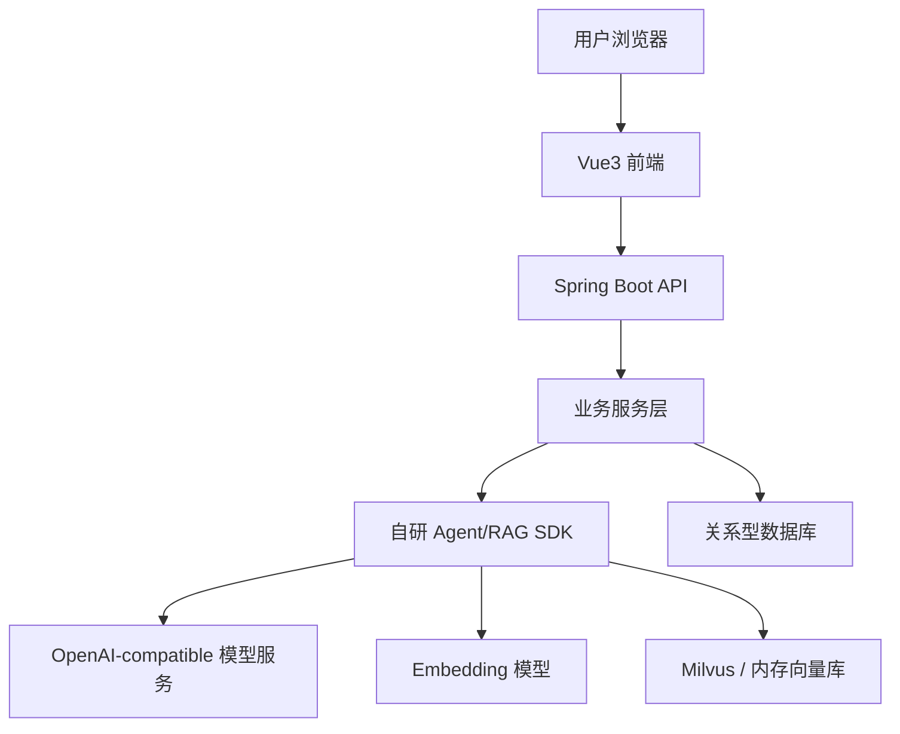
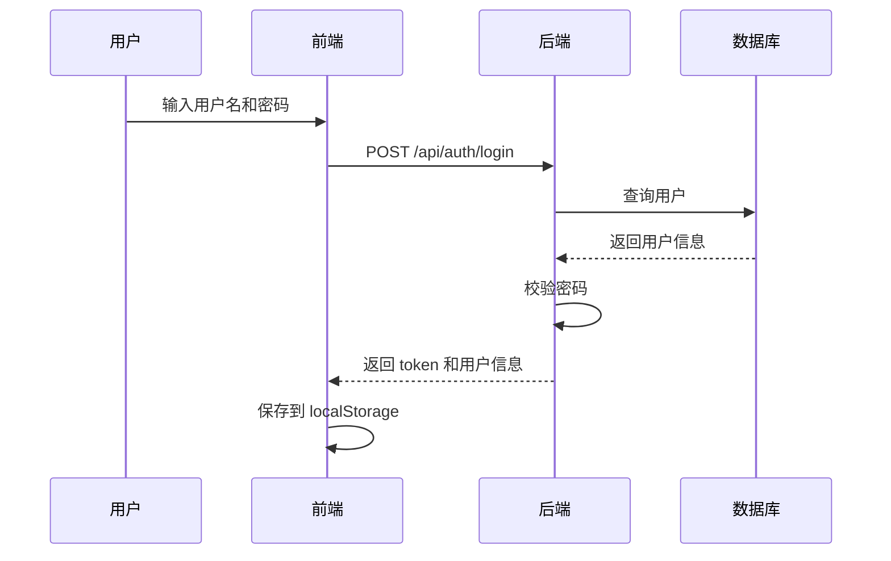
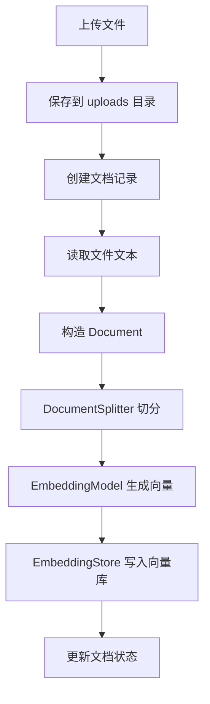
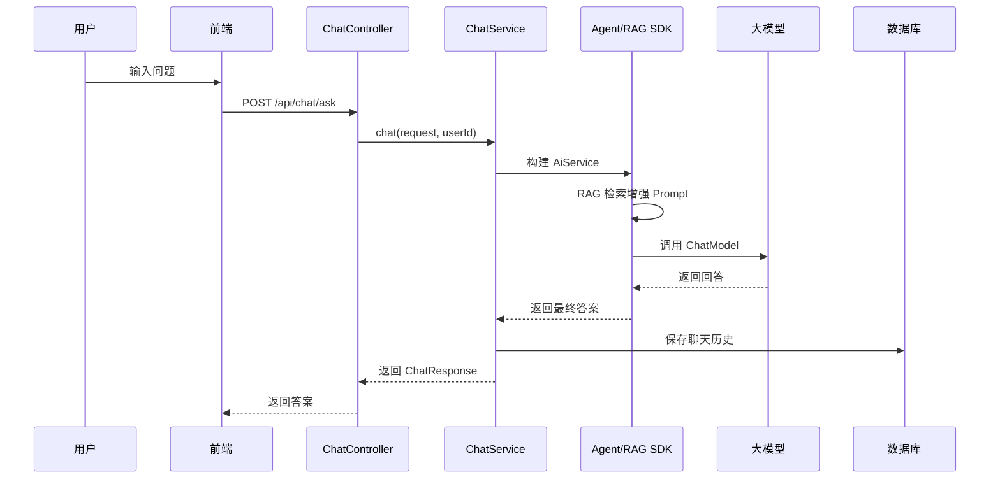
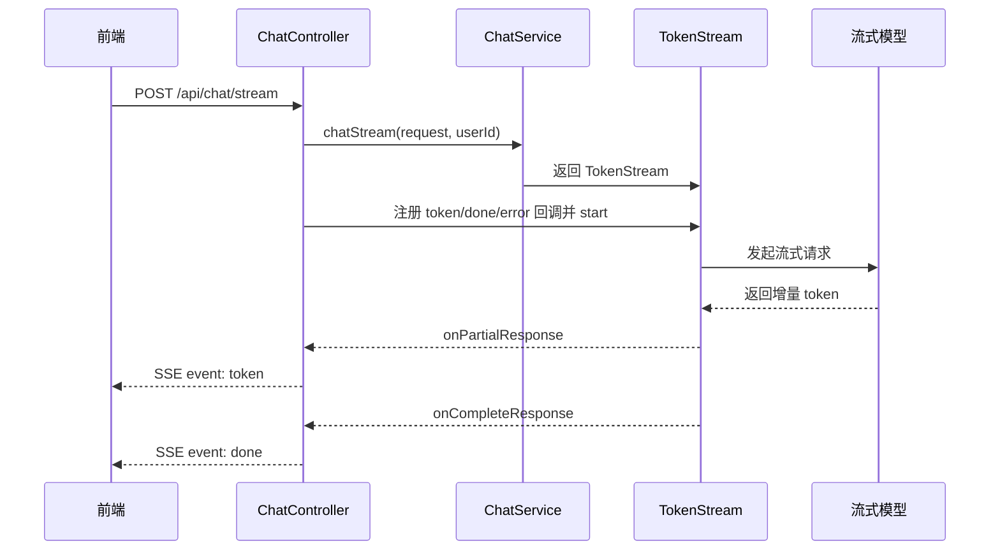
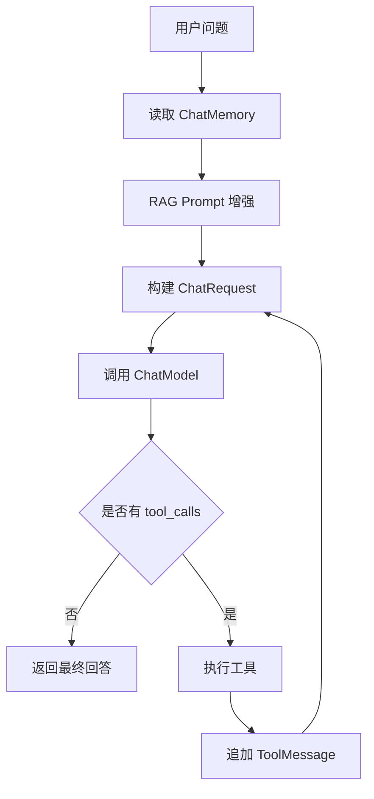
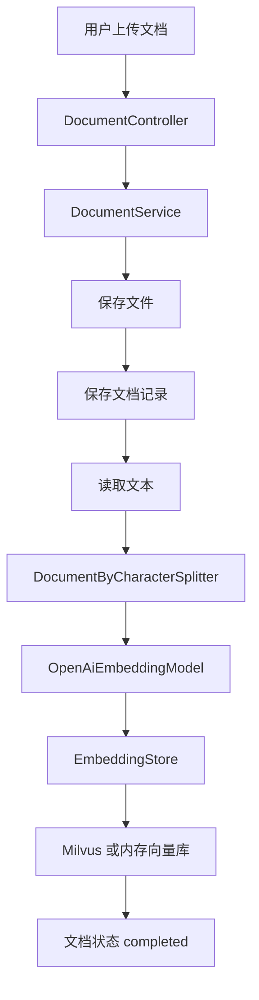
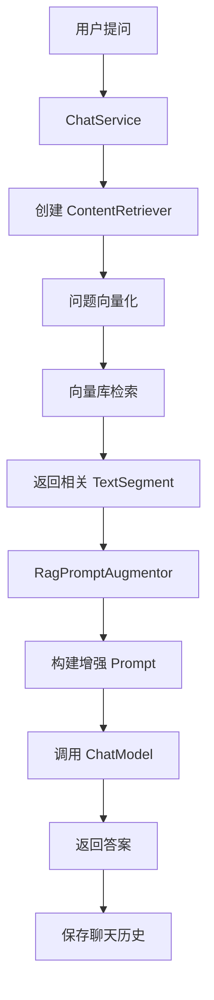
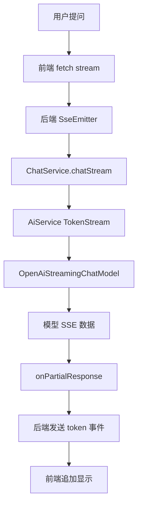

# 基于大模型的企业知识库智能问答系统项目说明文档

## 1. 项目简介

本项目是一个基于大模型、向量数据库和自研轻量级 Agent/RAG SDK 构建的企业知识库智能问答系统。系统采用前后端分离架构，前端使用 Vue3、TypeScript、Vite 和 Element Plus，后端使用 Spring Boot，向量检索部分支持内存向量库和 Milvus，模型调用层适配 OpenAI-compatible 接口。

项目的核心目标不是简单地调用一个大模型接口，而是围绕“企业文档如何变成可检索知识，并让用户基于知识库进行问答”这个场景，完成从文档上传、文本切分、向量化、向量存储、知识检索、Prompt 增强、模型回答、流式输出、会话记忆到历史记录管理的完整闭环。

在这个系统中，最有价值的部分是自研 SDK。它虽然还不是成熟可发布的框架，但已经把大模型调用、Agent Loop、工具调用、RAG 检索、向量存储、流式响应等核心能力拆成了较清晰的接口和模块。业务系统可以通过 SDK 提供的抽象能力来完成智能问答，而不是在业务代码里硬编码一堆模型 API 调用逻辑。

一句话概括：

> 这是一个以企业知识库问答为应用场景、以自研轻量级 AI Agent/RAG SDK 为核心技术沉淀的 Spring Boot + Vue3 智能问答系统。

---

## 2. 项目定位

### 2.1 系统定位

本项目面向企业内部知识管理场景，解决以下问题：

- 企业文档分散，人工检索效率低。
- 普通关键词搜索不能理解语义。
- 用户希望像聊天一样查询知识库内容。
- 大模型直接回答容易脱离企业资料产生幻觉。
- 单纯调用模型 API 缺少文档解析、向量检索、上下文增强和会话管理能力。

因此，本项目采用 RAG，也就是 Retrieval-Augmented Generation，检索增强生成方案。系统先从企业文档中检索相关片段，再把检索结果作为上下文提供给大模型，使模型尽量基于知识库资料回答。

### 2.2 SDK 定位

项目中的 SDK 不是一个完整成熟的 LangChain4j 替代品，也不是生产级大模型平台。它目前更准确的定位是：

> 一个面向学习、验证和项目集成的轻量级 AI Agent/RAG SDK 原型。

它目前的价值主要体现在：

- 把模型调用、工具调用、记忆、RAG、向量存储拆成独立接口。
- 让业务系统通过 `AiService.builder(...)` 这种方式构建 AI 服务。
- 能跑通非流式问答、流式问答、RAG 检索和 Milvus 向量库接入。
- 具备继续扩展成独立 SDK 的基础结构。

它目前不应该被夸大为成熟框架，因为它还有明显不足：

- 文档解析能力仍然较弱。
- 文档切分策略偏简单。
- 向量检索过滤和知识库隔离还需要继续强化。
- Milvus 封装还比较薄。
- 错误恢复、重试、观测、并发安全等工程能力还不完整。

但从项目学习和作品展示角度看，它已经体现出一个重要能力：不是只会调接口，而是在尝试抽象 AI 应用开发中的底层通用能力。

---

## 3. 技术栈

### 3.1 前端技术栈

| 技术 | 用途 |
|---|---|
| Vue3 | 前端应用框架 |
| TypeScript | 前端类型约束 |
| Vite | 前端构建工具 |
| Element Plus | UI 组件库 |
| Vue Router | 页面路由 |
| Fetch API | 调用后端接口 |
| SSE / ReadableStream | 接收流式回答 |
| Markdown 简易渲染 | 展示模型回答内容 |

前端主要页面包括：

- 登录页面
- 仪表盘页面
- 知识库管理页面
- 文档上传页面
- 智能问答页面
- 历史会话列表

### 3.2 后端技术栈

| 技术 | 用途 |
|---|---|
| Spring Boot | 后端主框架 |
| Spring MVC | REST API |
| Spring Data JPA | 数据访问 |
| MySQL / 关系型数据库 | 用户、知识库、文档、聊天历史存储 |
| MultipartFile | 文档上传 |
| SSE Emitter | 后端流式响应 |
| Java HttpClient | 调用模型服务 |
| Jackson | JSON 序列化与反序列化 |
| Gson | Milvus 写入数据结构处理 |
| Milvus Java SDK v2 | 向量数据库操作 |
| SLF4J | 日志输出 |

### 3.3 AI 与向量检索技术

| 模块 | 当前实现 |
|---|---|
| Chat Model | OpenAI-compatible Chat Completions |
| Streaming Chat Model | OpenAI-compatible SSE 流式响应 |
| Embedding Model | OpenAI-compatible Embeddings |
| 向量存储 | InMemoryEmbeddingStore / MilvusEmbeddingStore |
| 文档切分 | 按字符长度切分，支持 overlap |
| RAG 增强 | 检索片段拼入用户 Prompt |
| Agent Loop | 支持多轮模型请求与工具调用 |
| 工具调用 | 基于 `@Tool` 和 `@ToolParam` 注解 |

---

## 4. 项目整体架构

项目可以分为三个主要部分：

1. 前端交互层
2. 后端业务层
3. 自研 Agent/RAG SDK 层

整体调用关系如下：



### 4.1 前端交互层

前端负责用户操作和结果展示，包括登录、知识库管理、文档上传、智能问答、历史会话查看等。用户在问答页面选择知识库并输入问题后，前端会调用后端 `/api/chat/stream` 接口。后端返回 SSE 流式数据后，前端逐段追加到聊天窗口，实现类似实时输出的效果。

### 4.2 后端业务层

后端业务层负责：

- 用户登录和注册。
- 知识库创建、查询、删除。
- 文档上传、保存和状态管理。
- 文档内容读取和向量化处理。
- 调用 SDK 完成 RAG 问答。
- 聊天历史保存和查询。
- 用户聊天记忆持久化。

### 4.3 SDK 层

SDK 层是项目的技术核心。它不直接依赖具体业务页面，而是提供一组 AI 能力抽象：

- 模型调用抽象
- 流式模型抽象
- Embedding 抽象
- 向量存储抽象
- 文档抽象
- 文档切分抽象
- 内容检索抽象
- Prompt 增强
- Agent Loop
- 工具调用
- 聊天记忆
- TokenStream 流式回调

业务层通过 SDK 组合出知识库问答能力。

---

## 5. 业务功能说明

## 5.1 用户认证模块

用户模块目前实现了基础登录和注册能力。

主要功能：

- 用户注册
- 用户登录
- 默认管理员账号初始化
- 默认演示账号初始化
- 前端保存用户信息
- 后端通过请求头 `X-User-Id` 识别当前用户

当前认证方式偏演示性质。登录后后端生成 token，但权限校验主要依赖 `X-User-Id` 请求头，而不是严格的 JWT 鉴权或 Session 管理。

这一点在项目说明中应该如实表达：

> 当前认证模块用于支撑系统演示和基础用户隔离，尚未达到生产级安全要求。

### 5.1.1 相关接口

| 接口 | 方法 | 说明 |
|---|---|---|
| `/api/auth/login` | POST | 用户登录 |
| `/api/auth/register` | POST | 用户注册 |

### 5.1.2 登录流程



---

## 5.2 知识库管理模块

知识库是文档和问答的组织单位。用户可以创建多个知识库，每个知识库下面可以上传多个文档，问答时用户需要选择一个知识库。

主要功能：

- 创建知识库
- 查询当前用户知识库
- 查询所有知识库
- 查询知识库详情
- 删除知识库
- 统计知识库文档数量

### 5.2.1 相关接口

| 接口 | 方法 | 说明 |
|---|---|---|
| `/api/kb` | POST | 创建知识库 |
| `/api/kb` | GET | 查询当前用户知识库 |
| `/api/kb/all` | GET | 查询全部知识库 |
| `/api/kb/{id}` | GET | 查询知识库详情 |
| `/api/kb/{id}` | DELETE | 删除知识库 |

### 5.2.2 数据字段

知识库实体主要包括：

- `id`：知识库 ID
- `name`：知识库名称
- `description`：知识库描述
- `docCount`：文档数量
- `createdBy`：创建用户
- `createdAt`：创建时间
- `updatedAt`：更新时间

---

## 5.3 文档管理模块

文档模块负责接收用户上传的文件，并把文件内容处理成向量数据。

目前文档处理流程主要面向纯文本文件，上传后会将文件保存到本地上传目录，然后读取文本内容，构造 `Document` 对象，经过字符切分后调用 Embedding 模型生成向量，并写入向量库。

### 5.3.1 相关接口

| 接口 | 方法 | 说明 |
|---|---|---|
| `/api/document/upload` | POST | 上传单个文档 |
| `/api/document/batch-upload` | POST | 批量上传文档 |
| `/api/document/list/{kbId}` | GET | 查询知识库下的文档 |
| `/api/document/{id}` | DELETE | 删除文档记录 |

### 5.3.2 文档处理流程



### 5.3.3 当前实现特点

当前文档处理实现比较直接：

- 文件保存到本地目录。
- 文档状态包括 `processing`、`completed`、`failed`。
- 使用 `DocumentByCharacterSplitter(500, 50)` 进行切分。
- 每个片段携带 `kb_id`、`file_name` 等元数据。
- 调用 `EmbeddingStoreIngestor` 统一完成切分、向量化、入库。

### 5.3.4 当前不足

文档模块仍然比较初级：

- 主要适配纯文本读取。
- 对 PDF、Word、Excel 等复杂格式支持不足。
- 没有独立的文档解析器选择机制。
- 删除文档时目前主要删除业务记录，向量库中的对应向量清理能力需要补齐。
- 处理过程虽然注释写了异步，但实际逻辑仍偏同步。
- 文件处理失败后的错误信息记录不够完整。

---

## 5.4 智能问答模块

智能问答模块是系统面向用户的核心功能。用户选择知识库后输入问题，系统基于知识库文档内容检索相关片段，再调用大模型生成回答。

### 5.4.1 相关接口

| 接口 | 方法 | 说明 |
|---|---|---|
| `/api/chat/ask` | POST | 非流式问答 |
| `/api/chat/stream` | POST | 流式问答 |
| `/api/chat/history` | GET | 查询用户聊天历史 |
| `/api/chat/history/kb/{kbId}` | GET | 查询指定知识库聊天历史 |
| `/api/chat/memory` | DELETE | 清空用户聊天记忆 |

### 5.4.2 非流式问答流程



### 5.4.3 流式问答流程

流式问答使用 `SseEmitter` 向前端推送数据，前端通过 `ReadableStream` 持续读取后端返回的 `text/event-stream`。



### 5.4.4 系统提示词

当前知识库助手的系统提示词强调：

- 它是企业知识库助手。
- 应基于资料回答。
- 如果资料中没有相关信息，应如实告知。
- 回答要简洁、准确、有条理。

这个提示词虽然简单，但已经明确了 RAG 系统最基本的约束：不能随意脱离资料瞎答。

---

## 6. 自研 SDK 详细说明

SDK 位于 `service/agent` 模块中，包名以 `com.example.agent` 开头。它是项目中最值得重点说明的部分。

### 6.1 SDK 总体结构

SDK 大致可以分为以下模块：

| 模块 | 说明 |
|---|---|
| `core.agent` | Agent 运行参数和日志 |
| `core.annotation` | 工具注解 |
| `core.memory` | 聊天记忆接口与窗口记忆实现 |
| `core.message` | ChatMessage 体系 |
| `core.model` | 模型调用接口 |
| `core.prompt` | Prompt / ChatRequest 构建 |
| `core.rag.document` | 文档、片段、切分、解析 |
| `core.rag.embedding` | Embedding、检索请求、检索结果、向量存储接口 |
| `core.rag.ingestion` | 文档入库流程 |
| `core.rag.retriever` | 内容检索和 Prompt 增强 |
| `core.request` | 模型请求对象 |
| `core.service` | AiService、AgentRunner、TokenStream |
| `core.tool` | 工具扫描、工具元数据、工具执行 |
| `infrastructure.rag.store` | 内存向量库 |
| `provider.openai` | OpenAI-compatible 模型适配 |
| `provider.milvus` | Milvus 向量库适配 |

---

## 6.2 模型调用抽象

SDK 中把模型能力抽象成几个核心接口。

### 6.2.1 ChatModel

`ChatModel` 表示非流式大模型调用。

职责：

- 接收 `ChatRequest`
- 调用模型服务
- 返回 `ChatModelResponse`

业务层不需要直接关心 HTTP 请求怎么拼，模型响应怎么解析，而是通过接口调用。

### 6.2.2 StreamingChatModel

`StreamingChatModel` 表示流式大模型调用。

职责：

- 接收 `ChatRequest`
- 接收 `StreamingResponseHandler`
- 在模型返回 token 时触发回调
- 支持 reasoning、content、tool_calls、complete、error 等生命周期

### 6.2.3 EmbeddingModel

`EmbeddingModel` 表示文本向量化模型。

职责：

- 将单个文本转成向量
- 将多个 `TextSegment` 批量转成向量

目前 `OpenAiEmbeddingModel` 通过 `/embeddings` 接口调用兼容服务。

---

## 6.3 AiService 动态代理

SDK 提供了一个类似 LangChain4j 风格的使用方式：

```java
KnowledgeAssistant assistant = AiService.builder(KnowledgeAssistant.class)
        .chatModel(chatModel)
        .chatMemory(memory)
        .contentRetriever(contentRetriever)
        .systemMessage("你是一个专业的企业知识库助手...")
        .build();

String answer = assistant.chat(question);
```

业务层只需要定义接口：

```java
public interface KnowledgeAssistant {
    String chat(String message);
}
```

SDK 会通过 JDK 动态代理生成接口实现。调用接口方法时，实际会进入 `AiServiceInvocationHandler`，再根据返回类型决定走非流式 AgentRunner，还是流式 StreamingAgentRunner。

### 6.3.1 设计价值

这种设计的价值在于：

- 业务代码更简洁。
- AI 调用和业务逻辑解耦。
- 同一个 SDK 可以支持不同业务助手接口。
- 便于后续扩展注解、参数绑定、系统提示词模板等能力。

### 6.3.2 当前不足

当前实现还比较简单：

- 方法参数只是简单拼接成字符串。
- 没有支持复杂参数模板。
- 没有支持方法级注解配置 system prompt。
- 没有支持结构化返回。
- 对接口方法签名的约束还比较粗。

所以它目前是一个可运行的动态代理雏形，还不是完整的 AI Service 编排框架。

---

## 6.4 AgentOptions 运行参数

`AgentOptions` 用于保存 Agent 运行时配置。

当前支持：

| 参数 | 说明 |
|---|---|
| `maxAgentSteps` | 最大 Agent 循环步数 |
| `temperature` | 模型温度 |
| `logEnabled` | 是否启用日志 |
| `failFastOnToolError` | 工具调用失败时是否直接终止 |
| `maxTokens` | 最大输出 token 数 |
| `enableThinking` | 是否启用思考能力参数 |

这部分体现出 SDK 已经开始把“模型请求参数”和“Agent 运行参数”从业务代码中抽离出来。

---

## 6.5 Agent Loop

Agent Loop 是 SDK 中负责模型调用和工具调用闭环的核心逻辑。

### 6.5.1 非流式 Agent Loop

非流式 Agent Loop 由 `AgentRunner` 负责。

流程如下：

1. 从 ChatMemory 中读取历史消息。
2. 使用 RAG 对用户问题进行增强。
3. 构建 `ChatRequest`。
4. 调用 `ChatModel`。
5. 如果模型没有返回工具调用，则直接返回最终回答。
6. 如果模型返回工具调用，则执行工具。
7. 将工具结果以 `ToolMessage` 形式加入消息列表。
8. 继续下一轮模型调用。
9. 超过最大步数后抛出异常，防止无限循环。



### 6.5.2 流式 Agent Loop

流式 Agent Loop 由 `StreamingAgentRunner` 负责。

它和非流式版本类似，但模型调用过程通过 `StreamingResponseHandler` 接收增量内容。

当前流式能力支持：

- 增量内容回调
- 推理内容回调
- 工具调用回调
- 完整响应回调
- 错误回调

---

## 6.6 工具调用模块

SDK 支持通过注解定义工具。

主要组成：

- `@Tool`
- `@ToolParam`
- `ToolScanner`
- `ToolMetadata`
- `ToolSchemaBuilder`
- `ToolExecutor`
- `ToolCall`

### 6.6.1 工作流程

1. 用户在本地 Java 对象中定义工具方法。
2. 使用 `@Tool` 标记工具。
3. 使用 `@ToolParam` 描述参数。
4. SDK 扫描工具对象生成工具元数据。
5. PromptBuilder 把工具元数据转成模型可识别的 tools schema。
6. 模型返回 tool_calls。
7. SDK 根据工具名找到 Java 方法。
8. SDK 解析参数并反射调用工具方法。
9. 工具结果作为 ToolMessage 回填给模型。

### 6.6.2 设计意义

这说明 SDK 已经不只是问答封装，而是具备了 Agent 的基本能力：模型可以通过工具调用影响执行过程。

不过目前工具调用仍然是基础版：

- 参数类型支持有限。
- 异常处理较简单。
- 工具权限控制没有做。
- 工具调用审计没有完善。
- 工具调用并发和超时控制还没有系统设计。

---

## 6.7 ChatMemory 记忆模块

SDK 定义了 `ChatMemory` 接口，用于保存对话上下文。

当前有两个方向：

1. SDK 内部的 `MessageWindowChatMemory`
2. 业务系统中的 `MysqlChatMemory`

### 6.7.1 MessageWindowChatMemory

这是一个内存窗口记忆，只保留最近一定数量的消息。

适合：

- 单元测试
- Demo
- 临时对话
- 不要求持久化的场景

### 6.7.2 MysqlChatMemory

业务系统实现了基于数据库的记忆，把用户的聊天上下文保存到 `user_chat_memory_message` 表。

作用：

- 保留用户上下文。
- 支持多轮问答。
- 支持清空用户记忆。

当前不足：

- 会话隔离还不够完整。
- 主要按 userId 读取历史，没有严格按 sessionId 隔离记忆。
- 记忆裁剪策略简单。
- 没有摘要记忆能力。

---

## 6.8 RAG 文档抽象

SDK 中 RAG 的基础对象包括：

- `Document`
- `TextSegment`
- `DocumentParser`
- `DocumentSplitter`
- `DocumentByCharacterSplitter`

### 6.8.1 Document

`Document` 表示一个原始文档，通常包含：

- 文档 ID
- 文档文本
- 元数据

元数据中可以保存：

- 知识库 ID
- 文件名
- 文档类型
- 上传用户
- 分段索引

### 6.8.2 TextSegment

`TextSegment` 表示从文档中切出来的一段文本。

RAG 检索时，真正进入向量库的是一个个 `TextSegment`，而不是整个文档。

### 6.8.3 DocumentByCharacterSplitter

当前默认使用按字符长度切分的方式，例如：

```java
new DocumentByCharacterSplitter(500, 50)
```

含义：

- 每段最多 500 个字符。
- 相邻片段重叠 50 个字符。

优点：

- 实现简单。
- 能快速跑通文档切分。
- 对普通文本可用。

不足：

- 不理解 Markdown 标题。
- 不理解段落结构。
- 不理解表格。
- 不理解代码块。
- 可能把完整语义切断。

后续可以改进为：

- Markdown 标题分段。
- 段落优先切分。
- 句子边界切分。
- Token 数量切分。
- PDF / Word 结构化解析。
- 按章节、标题、编号建立层级 chunk。

---

## 6.9 Embedding 抽象

Embedding 模块负责把文本变成向量，并基于向量进行相似度检索。

核心类：

| 类 / 接口 | 说明 |
|---|---|
| `Embedding` | 向量对象，内部保存 float 数组 |
| `EmbeddingModel` | 向量模型接口 |
| `EmbeddingStore` | 向量存储接口 |
| `EmbeddingSearchRequest` | 向量检索请求 |
| `EmbeddingSearchResult` | 向量检索结果 |
| `EmbeddingMatch` | 单条检索命中结果 |
| `EmbeddingStoreIngestor` | 文档入库编排器 |

### 6.9.1 EmbeddingStore

`EmbeddingStore` 是向量存储抽象。

主要方法：

- `add(Embedding embedding, TextSegment segment)`
- `addAll(List<Embedding> embeddings, List<TextSegment> segments)`
- `search(EmbeddingSearchRequest request)`

这个接口让业务层不需要关心底层到底是内存向量库还是 Milvus。

### 6.9.2 EmbeddingSearchRequest

检索请求中包含：

- 查询向量
- 最大返回数量
- 最低分数

当前 `minScore` 支持在一定范围内设置，用于过滤低相关度片段。

### 6.9.3 EmbeddingStoreIngestor

`EmbeddingStoreIngestor` 用来编排文档入库流程：

1. 接收 Document。
2. 调用 DocumentSplitter 切分文档。
3. 调用 EmbeddingModel 生成向量。
4. 调用 EmbeddingStore 保存向量和文本片段。

它的意义是把“文档入库”这个重复流程抽成 SDK 能力。

---

## 6.10 ContentRetriever 与 RAG Prompt 增强

`ContentRetriever` 是检索器接口：

```java
List<TextSegment> retrieve(String query);
```

当前主要实现是 `EmbeddingStoreContentRetriever`。

工作流程：

1. 接收用户问题。
2. 使用 EmbeddingModel 生成问题向量。
3. 构造 EmbeddingSearchRequest。
4. 调用 EmbeddingStore 检索相似片段。
5. 返回 TextSegment 列表。

`RagPromptAugmentor` 会把检索结果拼接进用户消息，使模型回答时能够看到知识库资料。

### 6.10.1 当前 RAG Prompt 的作用

Prompt 增强的核心价值：

- 大模型不只依赖自身参数知识。
- 回答更贴近上传文档。
- 能降低幻觉概率。
- 能让问答系统具备企业知识库能力。

### 6.10.2 当前不足

当前 RAG 仍然是基础版本：

- 没有 rerank。
- 没有 query rewrite。
- 没有多路召回。
- 没有 BM25 + 向量混合检索。
- 没有引用来源编号。
- 没有严格的知识库过滤表达式。
- 没有答案可信度评估。

尤其需要注意的是：

> 目前业务层传入了 `kbId`，文档入库时也写入了 `kb_id` 元数据，但 Milvus 搜索请求中的 filter 还没有真正用起来。因此从严格意义上说，知识库隔离能力还需要继续完善。

这是一处后续必须优先修复的点。

---

## 6.11 Milvus 向量库适配

SDK 中 Milvus 相关类包括：

| 类 | 说明 |
|---|---|
| `MilvusConnectionConfig` | Milvus 连接和字段配置 |
| `MilvusEmbeddingStore` | 实现 EmbeddingStore 接口 |
| `MilvusJavaClientAdapter` | 封装 Milvus Java SDK 调用 |
| `MilvusInsertRow` | 插入行对象 |
| `MilvusSearchRequest` | Milvus 检索请求 |
| `MilvusSearchHit` | Milvus 检索结果 |
| `MilvusPrimaryKeyMode` | 主键模式 |

### 6.11.1 MilvusConnectionConfig

支持配置：

- `uri`
- `token`
- `databaseName`
- `collectionName`
- `idFieldName`
- `contentFieldName`
- `vectorFieldName`
- `metadataFieldName`
- `dimension`
- `primaryKeyMode`
- `flushAfterInsert`

这让 SDK 能适配不同 Milvus 集合字段，而不是把字段名全部写死。

### 6.11.2 主键模式

当前支持三种主键模式：

| 模式 | 说明 |
|---|---|
| `INT64_AUTO` | Milvus 自动生成 Int64 主键 |
| `INT64_MANUAL` | 手动传入 Int64 主键 |
| `VARCHAR_MANUAL` | 手动传入字符串主键 |

### 6.11.3 插入流程

插入时会：

1. 校验数据行。
2. 校验向量维度。
3. 写入 content 字段。
4. 写入 metadata 字段。
5. 写入 vector 字段。
6. 调用 Milvus insert。
7. 可选 flush。
8. 返回主键列表。

### 6.11.4 检索流程

检索时会：

1. 校验查询向量。
2. 构造 `SearchReq`。
3. 指定向量字段。
4. 指定返回字段。
5. 调用 Milvus search。
6. 根据 score 过滤。
7. 读取 id、content、metadata。
8. 转换成 `MilvusSearchHit`。
9. 再转换成 SDK 的 `EmbeddingMatch`。

### 6.11.5 当前不足

Milvus 封装目前已经能跑通基本插入和搜索，但还很薄：

- 没有集合自动创建能力。
- 没有索引自动创建能力。
- 没有 load collection 管理。
- 没有 delete by documentId。
- `filter` 字段存在但搜索时没有真正使用。
- 没有分区策略。
- 没有批量写入优化。
- 没有连接生命周期关闭。
- 没有重试机制。
- 没有统一的距离度量配置。

因此，Milvus 适配目前是“可用原型”，不是完整生产封装。

---

## 6.12 OpenAI-compatible Provider

SDK 当前适配了 OpenAI-compatible 风格的模型接口。

主要类：

| 类 | 说明 |
|---|---|
| `OpenAiChatModel` | 非流式聊天模型 |
| `OpenAiStreamingChatModel` | 流式聊天模型 |
| `OpenAiEmbeddingModel` | Embedding 模型 |
| `OpenAiChatRequestBuilder` | 请求体构建 |
| `OpenAiChatResponseParser` | 非流式响应解析 |
| `OpenAiStreamParser` | 流式响应解析 |
| `OpenAiStreamToolCallAccumulator` | 流式工具调用增量拼接 |
| DTO classes | 请求和响应数据结构 |

### 6.12.1 OpenAiChatModel

负责：

- 构建 HTTP 请求。
- 设置 Authorization。
- 设置 Content-Type。
- 序列化 ChatRequest。
- 处理 HTTP 错误。
- 解析模型返回内容。
- 返回统一的 `ChatModelResponse`。

### 6.12.2 OpenAiStreamingChatModel

负责：

- 发送 `Accept: text/event-stream` 请求。
- 按行读取 SSE 数据。
- 解析 `data:` 内容。
- 识别 `[DONE]`。
- 区分 content、reasoning、tool_call delta。
- 将增量内容交给 StreamingResponseHandler。

### 6.12.3 OpenAiEmbeddingModel

负责：

- 调用 `/embeddings`。
- 支持批量输入。
- 指定 encoding format。
- 指定维度。
- 校验返回向量数量。

### 6.12.4 当前不足

Provider 层目前仍然比较基础：

- 没有统一 Provider 配置体系。
- 没有重试、限流、退避。
- 没有模型能力声明。
- 没有 token 使用量统计暴露。
- 没有多 provider 路由。
- 错误类型还不够细。

---

## 7. 后端业务与 SDK 的结合方式

项目不是孤立写了一个 SDK，而是把 SDK 嵌入到了真实业务流程中。

### 7.1 AgentConfig 配置

后端通过 Spring 配置类创建 SDK 相关 Bean：

- `ChatModel`
- `StreamingChatModel`
- `EmbeddingModel`
- `EmbeddingStore`

根据配置项决定使用 Milvus 还是内存向量库：

```java
if (milvusEnabled) {
    return MilvusEmbeddingStore.builder().config(config).build();
}
return new InMemoryEmbeddingStore();
```

这使得系统可以在开发阶段用内存向量库快速测试，在需要真实持久化向量检索时切换到 Milvus。

### 7.2 DocumentService 使用 SDK 入库

文档上传后，业务层调用 SDK：

```java
EmbeddingStoreIngestor ingestor = EmbeddingStoreIngestor.builder()
        .documentSplitter(splitter)
        .embeddingModel(embeddingModel)
        .embeddingStore(embeddingStore)
        .build();

ingestor.ingest(document);
```

这说明文档入库的核心流程已经交给 SDK 编排，而不是散落在业务层。

### 7.3 ChatService 使用 SDK 问答

问答时，业务层创建 ContentRetriever，再构建 AiService：

```java
KnowledgeAssistant assistant = AiService.builder(KnowledgeAssistant.class)
        .chatModel(chatModel)
        .chatMemory(memory)
        .contentRetriever(contentRetriever)
        .systemMessage("你是一个专业的企业知识库助手...")
        .build();
```

然后直接调用：

```java
String answer = assistant.chat(request.question());
```

这就是 SDK 对业务层最大的价值：让业务代码只表达“我要一个知识库助手”，而不是每次手写模型请求、检索、Prompt 拼接和历史消息处理。

---

## 8. 数据库设计说明

当前系统主要包含以下业务表。

### 8.1 用户表 sys_user

用于保存用户信息。

主要字段：

| 字段 | 说明 |
|---|---|
| `id` | 用户 ID |
| `username` | 用户名 |
| `password` | 密码哈希 |
| `nickname` | 昵称 |
| `role` | 角色 |
| `created_at` | 创建时间 |
| `updated_at` | 更新时间 |

### 8.2 知识库表 knowledge_base

用于保存知识库信息。

主要字段：

| 字段 | 说明 |
|---|---|
| `id` | 知识库 ID |
| `name` | 知识库名称 |
| `description` | 知识库描述 |
| `doc_count` | 文档数量 |
| `created_by` | 创建人 |
| `created_at` | 创建时间 |
| `updated_at` | 更新时间 |

### 8.3 文档表 knowledge_document

用于保存上传文档记录。

主要字段：

| 字段 | 说明 |
|---|---|
| `id` | 文档 ID |
| `kb_id` | 所属知识库 ID |
| `file_name` | 原始文件名 |
| `file_type` | 文件类型 |
| `file_size` | 文件大小 |
| `file_path` | 文件保存路径 |
| `chunk_count` | 切分片段数量 |
| `status` | 处理状态 |
| `uploaded_by` | 上传用户 |
| `created_at` | 创建时间 |
| `updated_at` | 更新时间 |

### 8.4 聊天历史表 chat_history

用于保存用户问答历史。

主要字段：

| 字段 | 说明 |
|---|---|
| `id` | 历史记录 ID |
| `user_id` | 用户 ID |
| `kb_id` | 知识库 ID |
| `session_id` | 会话 ID |
| `question` | 用户问题 |
| `answer` | 模型回答 |
| `created_at` | 创建时间 |

### 8.5 用户记忆表 user_chat_memory_message

用于保存用户上下文记忆。

主要字段：

| 字段 | 说明 |
|---|---|
| `id` | 记录 ID |
| `user_id` | 用户 ID |
| `session_id` | 会话 ID |
| `role` | 消息角色 |
| `content` | 消息内容 |
| `message_order` | 消息顺序 |
| `created_at` | 创建时间 |

---

## 9. 前端页面说明

### 9.1 登录页面

登录页面负责用户登录和注册入口展示。

功能：

- 用户名输入
- 密码输入
- 登录请求
- 注册跳转或注册操作
- 登录成功后保存用户信息
- 跳转到仪表盘

### 9.2 仪表盘页面

仪表盘页面展示系统概览。

主要内容：

- 知识库数量
- 文档数量
- 问答次数
- 当前用户
- 快捷操作
- 最近知识库

### 9.3 知识库管理页面

知识库管理页面负责知识库和文档操作。

主要功能：

- 创建知识库
- 查看知识库列表
- 删除知识库
- 上传文档
- 批量上传文档
- 查看文档列表

### 9.4 智能问答页面

问答页面是用户使用系统的核心界面。

主要功能：

- 选择知识库
- 新建会话
- 查看历史会话
- 切换会话
- 输入问题
- 接收流式回答
- Markdown 简易渲染

### 9.5 前端流式处理

前端调用 `/api/chat/stream` 后，会判断响应是否为 `text/event-stream`。如果是，则使用 reader 读取后端流数据。

当前后端事件类型主要包括：

| 事件名 | 说明 |
|---|---|
| `token` | 模型增量内容 |
| `done` | 回答完成并返回 sessionId |

---

## 10. 系统核心流程汇总

### 10.1 文档入库流程



### 10.2 RAG 问答流程



### 10.3 流式输出流程



---

## 11. 项目亮点

### 11.1 不只是调用大模型 API

项目不是简单地写一个 Controller 调模型，而是把 AI 应用所需的模型调用、Prompt 构造、RAG 检索、向量存储、流式输出等能力拆分成多个可复用模块。

### 11.2 自研轻量级 SDK

SDK 虽然仍然粗糙，但已经具备基础结构：

- ChatModel 抽象
- StreamingChatModel 抽象
- EmbeddingModel 抽象
- EmbeddingStore 抽象
- AiService 动态代理
- Agent Loop
- 工具调用
- TokenStream
- RAG Prompt 增强
- Milvus 适配

这比直接把所有逻辑写在业务 Service 里更有技术含量。

### 11.3 支持流式问答

系统支持后端 SSE + 前端流式读取，实现逐段输出回答，用户体验比普通阻塞式接口更好。

### 11.4 支持 Milvus

项目不仅实现了内存向量库，还接入了 Milvus，说明系统具备从 Demo 走向真实向量检索服务的基础。

### 11.5 业务闭环完整

系统包含：

- 用户登录
- 知识库管理
- 文档上传
- 文档向量化
- 知识库问答
- 聊天历史
- 聊天记忆
- 流式响应

整体链路是完整的。

---

## 12. 项目不足与真实评价

这一部分非常重要，因为项目不能只写优点。当前 SDK 和系统都还有明显工程问题。

### 12.1 SDK 成熟度不足

SDK 目前处于原型阶段，主要目标是跑通核心链路。它还没有达到独立发布、给别人稳定使用的程度。

主要问题：

- API 设计还不够统一。
- 一些异常信息不够规范。
- 部分注释和命名还需要整理。
- 部分 Builder 校验不完整。
- 流式和非流式逻辑存在一定重复。
- 没有完整测试覆盖。

### 12.2 RAG 检索还不够严谨

当前 RAG 的问题包括：

- 知识库过滤没有完全落到 Milvus filter。
- 检索结果没有引用来源。
- 没有 rerank。
- 没有 query rewrite。
- 没有混合检索。
- 没有 chunk 质量评估。

其中最优先要解决的是知识库隔离问题，否则不同知识库的数据可能在检索层混到一起。

### 12.3 文档解析能力弱

当前主要适合文本文件。企业知识库实际常见文件包括：

- PDF
- Word
- Excel
- PPT
- Markdown
- HTML
- 图片扫描件

这些还没有完善支持。

### 12.4 安全能力偏演示

当前认证和鉴权偏简单：

- token 没有真正用于后端鉴权。
- 主要依赖 `X-User-Id`。
- 密码哈希没有使用 BCrypt。
- 没有权限模型。
- 没有接口级授权。

适合课程项目和功能演示，不适合直接部署到真实企业环境。

### 12.5 Milvus 管理能力不完整

当前 Milvus 主要支持插入和搜索，不支持完整生命周期管理。

缺少：

- collection 自动创建
- index 自动创建
- load/release 管理
- delete by metadata
- filter 表达式
- 分区
- 批量优化
- 连接关闭

### 12.6 前端体验仍可优化

前端已经能完成主要功能，但还可以继续加强：

- 上传进度显示。
- 文档处理状态轮询。
- 回答引用来源展示。
- 流式错误提示。
- 移动端适配。
- Markdown 渲染安全性。
- 代码块高亮。

---

## 13. 后续优化路线

### 13.1 SDK 第一阶段优化

优先修复当前链路中最影响正确性的地方：

1. Milvus 检索增加 `kb_id` filter。
2. 文档删除时同步删除向量。
3. ChatMemory 按 userId + sessionId 隔离。
4. 统一异常类型。
5. 补充 SDK 单元测试。
6. 整理包结构和命名。
7. 优化日志输出，避免泄露完整 Prompt。

### 13.2 SDK 第二阶段优化

增强 SDK 的可用性：

1. 支持 Markdown 文档结构化切分。
2. 支持 PDF / Word 解析。
3. 支持 TokenTextSplitter。
4. 支持 rerank。
5. 支持引用来源。
6. 支持多 provider。
7. 支持模型能力配置。
8. 支持工具超时和权限控制。

### 13.3 SDK 第三阶段优化

让 SDK 更接近独立框架：

1. 提供 starter。
2. 提供自动配置。
3. 提供统一配置文件。
4. 提供注解式 AiService。
5. 提供结构化输出。
6. 提供 MCP 工具接入。
7. 提供评测模块。
8. 提供观测面板。

### 13.4 业务系统优化

业务系统后续可以继续增强：

1. JWT 鉴权。
2. 角色权限控制。
3. 文档处理队列。
4. 文档处理进度。
5. 知识库分享。
6. 团队空间。
7. 问答引用来源。
8. 答案反馈。
9. 检索命中分析。
10. 管理端统计报表。

---

## 14. 项目适合展示的说法

如果用于答辩、课程设计或项目介绍，可以这样说：

> 本项目实现了一个企业知识库智能问答系统，用户可以创建知识库、上传文档，并通过自然语言提问获取基于知识库内容的回答。系统采用前后端分离架构，后端基于 Spring Boot，前端基于 Vue3 和 TypeScript，向量检索支持 Milvus。项目重点不是简单调用大模型接口，而是自研了一个轻量级 AI Agent/RAG SDK，对模型调用、流式响应、工具调用、聊天记忆、文档切分、向量化、向量存储和 RAG Prompt 增强进行了基础抽象。当前 SDK 已经可以支撑系统完整链路运行，但仍处于原型阶段，后续需要继续加强文档解析、知识库隔离、向量删除、检索优化和安全能力。
---

## 15. 项目总结

本项目完成了一个从前端页面到后端服务，再到自研 AI SDK 和向量数据库的完整智能知识库问答系统。它的核心价值不在于 UI 多复杂，也不在于模型回答多惊艳，而在于项目内部已经形成了一套可复用的 AI 应用开发抽象。

从业务角度看，系统已经具备企业知识库的基本能力：

- 用户可以登录系统。
- 用户可以创建知识库。
- 用户可以上传文档。
- 系统可以对文档进行切分和向量化。
- 用户可以围绕知识库进行问答。
- 系统可以通过流式方式返回回答。
- 系统可以保存历史会话和用户记忆。

从技术角度看，SDK 已经完成了几个关键能力：

- 模型调用抽象。
- 流式输出抽象。
- Embedding 抽象。
- 向量库抽象。
- RAG 入库和检索流程。
- Agent Loop。
- 工具调用机制。
- Milvus 接入。
- AiService 动态代理。

> 本项目已经完成了企业知识库智能问答系统的主流程，并沉淀出一个早期可用的 Agent/RAG SDK。SDK 目前不完美，但它已经具备清晰的方向：把大模型应用中的通用能力从业务代码中抽离出来，逐步形成可复用、可扩展、可维护的 AI 应用开发基础设施。

